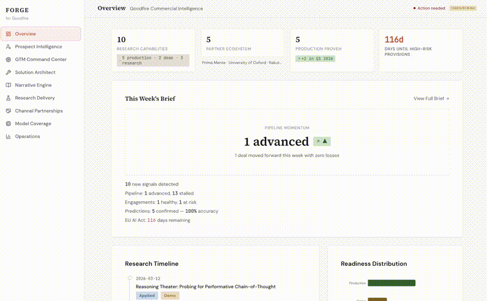

# Forge — Goodfire Commercial Intelligence OS

> **The operating system that turns Goodfire's frontier interpretability research into a self-improving commercial engine — from signal detection through deal close through partner expansion.**



---

## What Forge Does

Forge is a cross-functional intelligence system built on a unified Research Knowledge Graph. It manages the full commercial motion of a frontier research company: signal detection, prospect intelligence, engagement scoping, partner health, channel partnerships, and research-commercial alignment — all grounded in Goodfire's published interpretability research.

Every metric traces to a real benchmark. Every recommendation is explained. Every scoring system is self-calibrating.

## Quick Start

```bash
npm install
npm run dev
# Open http://localhost:3000
```

Optionally, add an Anthropic API key to `.env.local` for AI-powered outreach generation: ANTHROPIC_API_KEY=your_key_here  Forge works fully in demo mode without an API key. All features are functional with seed data.

## The Nine Interfaces

| # | Page | Purpose |
|---|---|---|
| 1 | **Overview** | Executive dashboard with research timeline, commercial intelligence snapshot, and this week's brief |
| 2 | **Prospect Intelligence** | 4-filter ICP scoring, peer cluster identification, concentrated outreach bursts, assessment scoping briefings |
| 3 | **GTM Command Center** | Signal detection with actionability scoring, ROI calculator grounded in real benchmarks, AI-powered outreach generation |
| 4 | **Solution Architect** | Three-stage engagement scoper with pricing engine: intake → capability match → simulation → tier classification → margin analysis → LTV projection → exportable proposal |
| 5 | **Narrative Engine** | Discourse monitoring, content calendar, audience-specific framing across four personas |
| 6 | **Research Delivery Hub** | Active engagement tracking, milestone CRUD, prediction reports with accuracy dashboard, partner health alerts, expansion opportunity identification |
| 7 | **Channel Partnerships** | Consulting firm relationship pipeline, certification tracking, Deloitte multiplier math, revenue attribution |
| 8 | **Model Family Coverage** | SAE readiness across three tiers, pipeline demand per model, decision trigger alerts, breakeven calculators |
| 9 | **Operations** | Strategic command center: TAM analysis, pipeline funnel, three revenue engines, ICP dashboard with adjustable weights, conversion analytics, weekly priority list, weekly GTM brief generator |

## Key Features

### Research-to-Revenue Translation
A structured Research Knowledge Graph containing every Goodfire capability, benchmark, and partner result. Signals automatically match to relevant capabilities. Outreach drafts reference specific benchmarks. Every claim is defensible.

### Palantir-Style Deal Architecture
The Solution Architect implements the acquire-expand-scale motion. The Pricing Engine auto-classifies engagements using a blockchain-audit-inspired tier system (Simple $75-100K through Critical $500K-2M), shows cost-to-deliver margins, and projects customer LTV using the 60% Tier 1→Tier 2 upsell rate.

### The Prediction Motion
The most differentiated feature in Forge. Every engagement can produce a Prediction Report — 5-10 specific, testable claims about model behavior that the customer's eval suite can't catch. Each prediction is tracked (confirmed/refuted/untested) and cumulative accuracy is computed by severity, model family, and engagement. This powers the "let us give you 10 predictions" sales motion that converts skeptics into Tier 2 buyers.

### Three Revenue Engines
- **Engine 1 (Direct):** Prospect pipeline with 4-filter ICP scoring, peer cluster outreach bursts, and executive dinner planning
- **Engine 2 (Channel):** Dedicated consulting partnership tracker showing the multiplier math (one Deloitte partnership = 50 warm introductions = projected revenue)
- **Engine 3 (Monitoring):** Runtime monitoring upsell identification triggered by engagement health

### Model Family Coverage Dashboard
Bridges commercial ambition and research capacity. Shows SAE readiness across three tiers (Available, Planned, On-Demand), pipeline demand per model, and decision trigger alerts (3+ qualified prospects AND $500K+ pipeline) that tell the research team exactly when to invest in new SAEs.

### Self-Improving Feedback Loops
Three calibrating mechanisms:
- **Signal Quality Feedback** — thumbs up/down on every signal, quality analytics by source type
- **Conversion Analytics** — track which signals, framings, and categories actually convert
- **Weight Auto-Tuning** — Forge suggests ICP and actionability weight adjustments based on conversion data

A system health indicator on every page monitors data freshness, prediction sample size, and feedback coverage — alerting when the system's intelligence is degrading.

### Weekly GTM Brief
Auto-generated Monday intelligence document pulling from all data layers: new signals, pipeline movement, engagement health, prediction outcomes, content published, competitive activity, channel partner updates, and top 5 priority targets with "WHY NOW" explanations. Exportable as markdown for the Monday 1:1.

## Data Integrity

Every metric, benchmark, and capability reference in Forge traces to Goodfire's published research:

- **RLFR** (Prasad et al., Feb 2026) — 58% hallucination reduction on Gemma 12B across 8 domains, 90x cheaper per intervention than LLM-as-judge
- **Reasoning Theater** (Boppana et al., Mar 2026) — 68% token savings on MMLU, 30% on GPQA-Diamond via probe-guided early exit
- **Rakuten PII Detection** (Nguyen et al., Oct 2025) — SAE probes deployed at 44M+ users with sub-millisecond overhead
- **Alzheimer's Biomarker Discovery** — Novel fragmentomics biomarker identified via mechanistic interpretability on Prima Mente's Pleiades foundation model
- **Evo 2 Interpretation** — Interpretability work on Arc Institute's genomic foundation model

## Architecture

Forge uses a three-layer data architecture:

- **Layer 1 — Reference Data:** capabilities, model families, pricing grids, customer categories, audience personas (changes quarterly)
- **Layer 2 — Operational State:** prospects, engagements, predictions, channel partners, milestones (changes daily)
- **Layer 3 — Event Log:** append-only audit trail feeding analytics, the weekly brief, and degradation awareness

### Stack

- Next.js 14 with App Router and TypeScript strict mode
- SQLite via better-sqlite3 with parameterized queries throughout
- Tailwind CSS with a warm editorial design system inspired by goodfire.ai
- Source Serif 4 for display, DM Sans for body, JetBrains Mono for data
- Recharts for visualizations
- Anthropic SDK for AI-powered outreach (optional, template fallback)

### By the Numbers

- **9 pages** covering the full commercial motion
- **~80 components** across 12 component directories
- **~20 library modules** with 50+ query functions
- **~15 API routes** serving typed JSON
- **21 database tables** across three data layers
- **150+ seed records** of real Goodfire research and realistic prospect data
- **50+ TypeScript interfaces** with zero `any` types

## Screenshots

### Operations — The CEO's Monday Dashboard


### Weekly GTM Brief


### Solution Architect with Pricing Engine


### Prospect Intelligence with ICP Breakdown


### Prediction Accuracy Dashboard


### Model Family Coverage


## Built By

Rachael Chew — [rachaelchew.com](https://rachaelchew.com)
